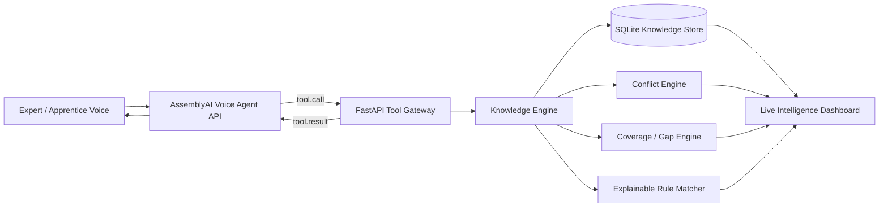

# TacitOS — Voice-to-Expertise Intelligence

> **Capture what experts know but never wrote down.**

TacitOS is a real-time voice knowledge compiler for the **AssemblyAI Voice Agent Hackathon**. It interviews experienced workers naturally, turns their undocumented judgment into structured and traceable decision rules, detects missing knowledge and contradictions, then lets the next worker talk to that expertise.

This is not a voice FAQ bot.

TacitOS is designed around a harder problem: **tacit knowledge** — the exceptions, thresholds, heuristics, and “I just know when…” decisions that live inside experienced employees but rarely make it into manuals.

---

## The problem

A senior technician might know:

> “After an overload I normally restart Pump B — unless vibration was high and suction pressure was falling. Then I check for cavitation first.”

A manual may only say:

> “Investigate overload and restart according to procedure.”

When that technician retires, transfers, or leaves, the highest-value part of their knowledge can disappear with them.

TacitOS converts that hidden expertise into machine-readable, auditable intelligence while the expert simply talks.

---

## 60-second demo story

### 1. Expert Capture

A senior engineer says:

> “Normally I restart Pump B after an overload, but if vibration was high and suction pressure was falling, I do not restart it. I inspect for cavitation first.”

TacitOS:

1. transcribes the expert in real time,
2. extracts a structured decision rule through AssemblyAI tool calling,
3. stores the expert, conditions, action, rationale, confidence, and source quote,
4. updates knowledge coverage,
5. checks for contradictions,
6. asks the best next question.

Example compiled rule:

```json
{
  "topic": "Pump B restart",
  "conditions": {
    "shutdown_reason": "overload",
    "vibration": "high",
    "suction_pressure": "falling"
  },
  "action": "Do not restart. Inspect for cavitation first.",
  "expert": "Alex Morgan",
  "confidence": 0.95
}
```

### 2. Active knowledge discovery

TacitOS notices that the expert has not explained what happens when:

```text
vibration = high
suction pressure = normal
```

Instead of ending the interview, it asks that missing branch.

If two experts give different actions for the same conditions, TacitOS creates a **conflict** instead of silently overwriting either expert.

### 3. Apprentice Guidance

Later, a junior technician says:

> “Pump B stopped after an overload. Vibration was high and suction pressure had been falling. Should I restart it?”

TacitOS retrieves matching expert knowledge and answers only when all required conditions are verified.

The recommendation remains traceable to:

- the expert,
- the original source quote,
- the matched conditions,
- the captured rule ID,
- the confidence.

If a required condition is missing, TacitOS returns **needs clarification** rather than guessing.

---

## Why voice is essential

Tacit knowledge is often easiest to capture **while the expert is doing the work**.

Technicians, operators, nurses, field engineers, mechanics, inspectors, lab staff, and other domain experts may not stop to write a formal knowledge base entry every time they make a nuanced decision.

Voice allows TacitOS to capture expertise conversationally while AssemblyAI handles:

- real-time speech recognition,
- neural turn detection,
- natural interruption / barge-in,
- LLM reasoning,
- text-to-speech,
- structured tool calling.

The browser connects to AssemblyAI's Voice Agent API through a short-lived server-minted token, so the API key never ships to the client.

---

## Architecture



### Core loop

```text
Expert voice
   ↓
AssemblyAI Voice Agent
   ↓
Structured tool call
   ↓
Knowledge rule + provenance
   ↓
Conflict / gap analysis
   ↓
Best next question
   ↓
More expert knowledge
```

Then:

```text
Apprentice voice
   ↓
Observed conditions
   ↓
Verified rule match
   ↓
Source-backed guidance
```

---

## Current features

- **Expert Capture mode**
- **Apprentice Guidance mode**
- Real-time AssemblyAI browser voice session
- Short-lived browser authentication tokens
- Neural turn-taking and interruption handling
- Structured expert-rule extraction
- Source quote + expert provenance
- SQLite persistence
- Contradiction detection
- Knowledge-gap / coverage analysis
- Active next-question planning
- Explainable deterministic rule matching
- Safety behavior for incomplete evidence
- Live transcript
- Live rule feed
- Contradiction radar
- Coverage dashboard
- Deterministic evaluation scenarios
- Pytest suite
- GitHub Actions CI
- Docker support

---

## Tool surface

The AssemblyAI agent can call four application tools:

### `capture_expert_rule`

Stores one reusable decision rule with:

- topic,
- conditions,
- action,
- rationale,
- source quote,
- expert,
- confidence.

### `inspect_knowledge_state`

Returns:

- rule count,
- coverage percentage,
- dimensions already captured,
- missing dimensions,
- open conflicts,
- recommended next interview question.

### `resolve_knowledge_conflict`

Records the expert explanation that differentiates two conflicting rules.

### `retrieve_expert_guidance`

Matches current observations against captured expert knowledge.

A recommendation is returned only when all conditions for a rule are known and matched. Partial matches are exposed as clarification opportunities rather than operational advice.

---

## Project structure

```text
AI-Assembly/
├── app/
│   ├── main.py              # FastAPI app + AssemblyAI token endpoint
│   ├── voice.py             # Agent prompts + AssemblyAI tool definitions
│   ├── tools.py             # Tool dispatcher
│   ├── engine.py            # knowledge / conflict / retrieval logic
│   ├── store.py             # SQLite persistence
│   ├── models.py
│   ├── config.py
│   └── static/
│       ├── index.html       # command-center UI
│       ├── app.js           # voice WebSocket + audio + tools
│       ├── styles.css
│       └── pcm-processor.js
├── data/
│   └── seed_expertise.json
├── evals/
│   ├── scenarios.json
│   └── run_eval.py
├── scripts/
│   └── seed_demo.py
├── tests/
│   └── test_engine.py
├── .github/workflows/ci.yml
├── Dockerfile
├── docker-compose.yml
└── requirements.txt
```

---

## Run locally

### 1. Clone

```bash
git clone https://github.com/muhammadaryan377/AI-Assembly.git
cd AI-Assembly
```

### 2. Create a virtual environment

```bash
python -m venv .venv
```

Windows:

```powershell
.venv\Scripts\activate
```

macOS / Linux:

```bash
source .venv/bin/activate
```

### 3. Install

```bash
pip install -r requirements.txt
```

### 4. Configure AssemblyAI

```bash
cp .env.example .env
```

Then put your key in:

```env
ASSEMBLYAI_API_KEY=your_key_here
```

### 5. Start the app

```bash
uvicorn app.main:app --reload
```

Open:

```text
http://localhost:8000
```

Browser microphone access works on localhost.

---

## Optional demo seed

To preload two Pump B expert rules:

```bash
python scripts/seed_demo.py
```

Then start the app and switch to **Apprentice** mode.

---

## Test

```bash
pytest -q
```

The test suite verifies:

- source-backed guidance retrieval,
- contradiction detection,
- rejection of mismatched rules,
- knowledge-gap detection.

---

## Evaluate

```bash
python evals/run_eval.py
```

The evaluation reports:

- scenario accuracy,
- unsupported guidance rate,
- per-scenario pass/fail results.

The benchmark intentionally treats unsupported operational advice as a failure. Missing required conditions should result in clarification rather than a recommendation.

---

## Docker

```bash
docker compose up --build
```

Then open:

```text
http://localhost:8000
```

---

## Safety philosophy

TacitOS does **not** assume that conversational fluency equals operational truth.

The system is designed around five constraints:

1. **Provenance over plausibility** — important guidance should map back to captured expert knowledge.
2. **Clarify before acting** — incomplete conditions do not produce a full rule match.
3. **Conflicts stay visible** — contradictory expert knowledge is escalated, not silently merged.
4. **Human knowledge remains attributable** — expert identity and source quote are preserved.
5. **Evaluation from day one** — behavior is tested against expected decision scenarios.

For real industrial, medical, or safety-critical deployment, TacitOS would require domain validation, access control, formal approval workflows, and integration with authoritative procedures.

---

## What makes TacitOS different

Most voice agents optimize:

```text
voice → request → answer
```

TacitOS optimizes:

```text
voice → expertise → structured knowledge → gaps → contradictions
                                      ↓
                             future verified decisions
```

The product is not merely the conversation.

**The product is the organizational intelligence left behind after the conversation ends.**

---

## Hackathon thesis

> **TacitOS turns the knowledge trapped inside your best employees' heads into a traceable AI that the next generation can talk to.**

Built with the AssemblyAI Voice Agent API.

